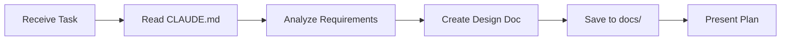

# Agent Rules

This file defines the operational guidelines for AI agents (Claude Code, Windsurf, Cursor, VSCode Copilot, etc.) working on this codebase. These rules take highest priority over any default behaviors.

## 🎯 Core Principles

1. **Reference Documentation First**: Always consult `@CLAUDE.md` for project-specific guidance
2. **MCP Configuration**: Check `@.mcp.json` for available MCP server configurations
3. **Minimal Changes**: Only modify what's necessary to achieve the goal
4. **Clear Communication**: Explain changes before implementation

## 📋 Git Workflow

### Staging & Commits

- **Add files progressively**: Use `git add` at logical checkpoints
- **Never auto-commit**: Only commit when explicitly requested or in yolo mode
- **Commit messages must**:
  - Be clear and descriptive
  - Focus on the "why" not just the "what"
  - NOT mention AI/Claude/agent generation
  - Follow conventional commit format when applicable

### Example Workflow

```bash
# After making changes
git add src/components/NewFeature.tsx
git status  # Show staged changes
# Present draft commit message to user
# Wait for user approval before committing
```

## 📝 Documentation Requirements

### Before Implementation

1. **Explain the approach**: Describe what will be changed and why
2. **Use diagrams**: Create Mermaid diagrams when helpful
3. **Save proposals**: Store design docs in `@docs/` directory

### After Implementation

1. **Review all changes**: Verify implementation matches proposal
2. **Summarize modifications**: Provide clear overview with diagrams
3. **Highlight key decisions**: Explain architectural choices

## 🔧 Tool Usage

### GitHub Operations

**Priority order**:

1. Use GitHub MCP server (configured in `.mcp.json`)
2. Fall back to `gh` CLI only if MCP unavailable
3. Verify correct GitHub account/token for repository

### MCP Servers Available

- **filesystem**: Local file operations
- **github-mcp-server**: GitHub API interactions
- **Framelink Figma MCP**: Figma design integration

## 🏗️ Development Workflow

### Planning Phase



### Implementation Phase

1. Follow approved design from docs
2. Make incremental changes
3. Stage files at checkpoints
4. Run linting/tests as specified in CLAUDE.md
5. Review implementation against original plan

## ⚡ Quick Reference

### Essential Commands (from CLAUDE.md)

```bash
npm run dev      # Development server
npm run build    # Production build
npm run lint     # Run ESLint
npm run test     # Run tests (if configured)
```

### File Locations

- Project docs: `@CLAUDE.md`
- MCP config: `@.mcp.json`
- Design docs: `@docs/`
- Source code: Follow structure in CLAUDE.md

## 🚫 Restrictions

1. **No unauthorized commits**: Always get user approval
2. **No AI attribution**: Never mention Claude/AI in commits or code
3. **No unnecessary files**: Don't create files unless essential
4. **Prefer editing**: Always edit existing files over creating new ones
5. **No proactive documentation**: Only create docs when requested

## ✅ Best Practices

1. **Ask before major changes**: Confirm approach for significant modifications
2. **Show don't tell**: Use code snippets and diagrams over long explanations
3. **Incremental progress**: Make small, testable changes
4. **Respect conventions**: Follow existing code style and patterns
5. **Security first**: Never expose secrets or credentials

---

_Remember: These rules override any default agent behavior. When in doubt, ask the user for clarification._
