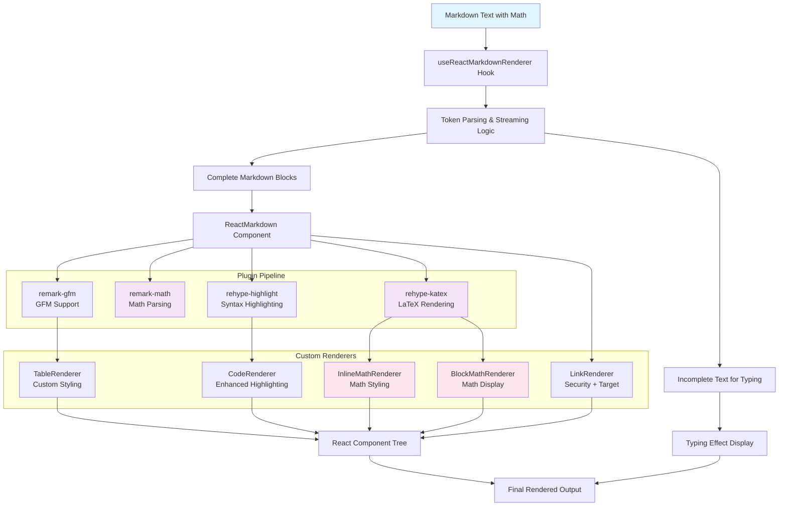

# React-Markdown Migration: Phase 2 Implementation Plan

## Executive Summary

This document outlines Phase 2 of the react-markdown migration project, focusing on implementing comprehensive math/LaTeX rendering support. Phase 1 successfully completed the core migration from `marked` to `react-markdown` with GFM support. Phase 2 will add mathematical expression rendering capabilities using KaTeX integration.

## Phase 1 Completion Status ✅

**Successfully Completed Features:**
- ✅ Core react-markdown integration with streaming/typing effect preservation
- ✅ GitHub Flavored Markdown (GFM) support via `remark-gfm`
- ✅ Syntax highlighting compatibility with `rehype-highlight`
- ✅ Custom component renderers (Table, Code, Link)
- ✅ Complete interface compatibility (`MarkdownRenderResult`)
- ✅ Security improvements (no `dangerouslySetInnerHTML`)
- ✅ Performance optimization with caching strategy
- ✅ `defaultLinkTarget` prop integration
- ✅ Comprehensive test coverage (23 tests)
- ✅ Production deployment in `text-template.tsx`

## Phase 2 Objectives

### Primary Goals
1. **Math/LaTeX Rendering**: Support for inline (`$x^2$`) and block (`$$equations$$`) mathematical expressions
2. **KaTeX Integration**: High-quality mathematical typesetting
3. **Error Handling**: Graceful fallbacks for invalid math syntax
4. **Performance**: Maintain system performance with math features
5. **Integration**: Seamless math support in existing streaming/typing system

### Architecture Overview



## Technical Implementation

### New Dependencies

```json
{
  "remark-math": "^6.0.0",
  "rehype-katex": "^7.0.1", 
  "katex": "^0.16.9"
}
```

**Dependency Analysis:**
- `remark-math`: Parses math expressions in markdown (~15KB)
- `rehype-katex`: Renders math using KaTeX (~25KB)
- `katex`: Mathematical typesetting library (~280KB)
- **Total Bundle Impact**: ~320KB (acceptable for math functionality)

### Plugin Configuration

```typescript
// Enhanced plugin configuration in use-react-markdown-renderer.tsx
import remarkMath from 'remark-math';
import rehypeKatex from 'rehype-katex';

const remarkPlugins = [remarkGfm, remarkMath];
const rehypePlugins = [rehypeHighlight, rehypeKatex];

// ReactMarkdown configuration
<ReactMarkdown
  remarkPlugins={remarkPlugins}
  rehypePlugins={rehypePlugins}
  components={components}
>
  {markdown}
</ReactMarkdown>
```

### Custom Math Renderers

```typescript
// Inline math renderer for expressions like $x^2$
const InlineMathRenderer = ({ children, ...props }: any): JSX.Element => (
  <span className="math math-inline" {...props}>
    {children}
  </span>
);

// Block math renderer for display equations like $$...$$
const BlockMathRenderer = ({ children, ...props }: any): JSX.Element => (
  <div className="math math-display" {...props}>
    {children}
  </div>
);

// Enhanced components configuration
const components = {
  table: TableRenderer,
  code: CodeRenderer,
  a: LinkRenderer,
  math: InlineMathRenderer,          // Inline math: $expression$
  div: ({ className, ...props }) =>   // Block math: $$expression$$
    className?.includes('math-display') ? 
      <BlockMathRenderer {...props} /> : 
      <div className={className} {...props} />
};
```

### Error Handling Strategy

```typescript
// Math error boundary component
const MathErrorBoundary = ({ children, fallback }: any) => {
  try {
    return children;
  } catch (error) {
    console.warn('Math rendering error:', error);
    return fallback || <span className="math-error">[Math Error]</span>;
  }
};

// Wrap math renderers with error boundaries
const SafeMathRenderer = ({ children, ...props }) => (
  <MathErrorBoundary fallback={<span className="math-fallback">{children}</span>}>
    <InlineMathRenderer {...props}>{children}</InlineMathRenderer>
  </MathErrorBoundary>
);
```

## Streaming Integration

### Math Expression Completion Detection

```typescript
// Enhanced completion detection for math expressions
function isCompleteParagraph(raw: string): boolean {
  // Existing completion logic
  const basicCompletion = (
    raw.trim().endsWith('\n\n') ||
    raw.trim().endsWith('\n') ||
    raw.trim().endsWith('.') ||
    raw.trim().endsWith('。') ||
    raw.trim().endsWith('！')
  );
  
  // Math-specific completion detection
  const mathCompletion = (
    !raw.includes('$') ||                    // No math expressions
    (raw.match(/\$/g) || []).length % 2 === 0  // Even number of $ signs
  );
  
  return basicCompletion && mathCompletion;
}
```

### Streaming Math Examples

```typescript
// Example streaming scenarios
const streamingExamples = [
  {
    input: "The quadratic formula is $x = \\frac{-b \\pm",
    expected: { complete: "", incomplete: "The quadratic formula is $x = \\frac{-b \\pm" }
  },
  {
    input: "The quadratic formula is $x = \\frac{-b \\pm \\sqrt{b^2 - 4ac}}{2a}$.",
    expected: { complete: "The quadratic formula is $x = \\frac{-b \\pm \\sqrt{b^2 - 4ac}}{2a}$.", incomplete: "" }
  }
];
```

## CSS & Styling Integration

### KaTeX CSS Import Strategy

```typescript
// Option 1: Component-level import (recommended)
import 'katex/dist/katex.min.css';

// Option 2: Application-level import
// Add to main CSS bundle or index.css
```

### Theme Integration

```scss
// Math expression styling integration
.math {
  &.math-inline {
    // Inherit text color from theme
    color: inherit;
    font-size: inherit;
    line-height: inherit;
  }
  
  &.math-display {
    // Block math styling
    margin: 1em 0;
    text-align: center;
    overflow-x: auto;
    
    // Theme integration
    background-color: var(--asgard-bg-color, transparent);
    border-radius: var(--asgard-border-radius, 4px);
  }
}

// Error state styling
.math-error {
  color: var(--asgard-error-color, #d32f2f);
  background-color: var(--asgard-error-bg, #ffebee);
  padding: 2px 4px;
  border-radius: 2px;
  font-family: monospace;
}
```

## Test Specifications

### Test Categories

#### 1. Basic Math Rendering Tests
```typescript
describe('math rendering', () => {
  it('should render inline math expressions', async () => {
    const markdown = 'The famous equation is $E = mc^2$ in physics.';
    const { result } = renderHook(() => useMarkdownRenderer(markdown, 0));
    await waitFor(() => {
      render(<div>{result.current.htmlBlocks}</div>);
      expect(screen.getByText('E = mc²')).toBeInTheDocument();
      expect(document.querySelector('.math.math-inline')).toBeInTheDocument();
    });
  });

  it('should render block math expressions', async () => {
    const markdown = '$$\\int_{-\\infty}^{\\infty} e^{-x^2} dx = \\sqrt{\\pi}$$';
    const { result } = renderHook(() => useMarkdownRenderer(markdown, 0));
    await waitFor(() => {
      render(<div>{result.current.htmlBlocks}</div>);
      expect(document.querySelector('.math.math-display')).toBeInTheDocument();
    });
  });
});
```

#### 2. Mixed Content Tests
```typescript
it('should handle mixed markdown and math content', async () => {
  const markdown = `# Math Section

Here's some **bold text** and inline math: $x^2 + y^2 = z^2$.

Block equation:
$$\\begin{aligned}
a &= b + c \\\\
d &= e + f
\\end{aligned}$$

- List item 1
- List item 2 with math: $\\alpha + \\beta$`;
  
  // Test complex integration scenarios
});
```

#### 3. Streaming Math Tests
```typescript
it('should handle streaming text with math expressions', async () => {
  const markdown = 'Incomplete math: $x = \\frac{1}{2';
  const { result } = renderHook(() => useMarkdownRenderer(markdown, 0));
  
  expect(result.current.htmlBlocks).toEqual(<div className={classes.md_container}></div>);
  expect(result.current.lastTypingText).toBe('Incomplete math: $x = \\frac{1}{2');
});
```

#### 4. Error Handling Tests
```typescript
it('should handle invalid math expressions gracefully', async () => {
  const markdown = 'Invalid math: $\\invalid{syntax$ should not crash';
  const { result } = renderHook(() => useMarkdownRenderer(markdown, 0));
  
  // Should not throw errors
  expect(() => render(<div>{result.current.htmlBlocks}</div>)).not.toThrow();
  
  // Should show fallback or error indicator
  expect(document.querySelector('.math-error, .math-fallback')).toBeInTheDocument();
});
```

#### 5. Performance Tests
```typescript
it('should maintain performance with math expressions', async () => {
  const complexMath = `$$\\begin{pmatrix}
    a_{11} & a_{12} & \\cdots & a_{1n} \\\\
    a_{21} & a_{22} & \\cdots & a_{2n} \\\\
    \\vdots & \\vdots & \\ddots & \\vdots \\\\
    a_{m1} & a_{m2} & \\cdots & a_{mn}
  \\end{pmatrix}$$`;

  const startTime = performance.now();
  const { result } = renderHook(() => useMarkdownRenderer(complexMath, 0));
  const endTime = performance.now();
  
  expect(endTime - startTime).toBeLessThan(100); // 100ms threshold
});
```

## Demo Integration Examples

### Math Template Examples

```typescript
// In apps/react-demo/src/pages/const.ts
export function createMathTemplateExample(): ConversationMessage {
  return createBaseTemplateExample({
    messageId: crypto.randomUUID(),
    replyToCustomMessageId: '',
    text: `# Mathematical Expressions Demo

## Inline Math Examples
- Pythagorean theorem: $a^2 + b^2 = c^2$
- Einstein's mass-energy equivalence: $E = mc^2$
- Quadratic formula: $x = \\frac{-b \\pm \\sqrt{b^2 - 4ac}}{2a}$
- Greek letters: $\\alpha + \\beta + \\gamma = \\delta$

## Block Math Examples

### Maxwell's Equations
$$\\begin{aligned}
\\nabla \\times \\vec{\\mathbf{B}} -\\, \\frac1c\\, \\frac{\\partial\\vec{\\mathbf{E}}}{\\partial t} &= \\frac{4\\pi}{c}\\vec{\\mathbf{j}} \\\\
\\nabla \\cdot \\vec{\\mathbf{E}} &= 4 \\pi \\rho \\\\
\\nabla \\times \\vec{\\mathbf{E}}\\, +\\, \\frac1c\\, \\frac{\\partial\\vec{\\mathbf{B}}}{\\partial t} &= \\vec{\\mathbf{0}} \\\\
\\nabla \\cdot \\vec{\\mathbf{B}} &= 0
\\end{aligned}$$

### Matrix Example
$$\\begin{pmatrix}
a & b \\\\
c & d
\\end{pmatrix}
\\begin{pmatrix}
x \\\\
y
\\end{pmatrix}
=
\\begin{pmatrix}
ax + by \\\\
cx + dy
\\end{pmatrix}$$

## Mixed Content
Regular text with **bold** and \`code\`, plus math: $\\sum_{i=1}^{n} x_i = S$.

### Lists with Math
1. First item: $f(x) = x^2$
2. Second item: $g(x) = \\sin(x)$
3. Third item: $h(x) = e^x$`,
    payload: null,
    isDebug: false,
    idx: 0,
    template: {
      type: MessageTemplateType.TEXT,
      text: '',
      quickReplies: [
        { text: 'Show more equations' },
        { text: 'Physics formulas' },
        { text: 'Mathematical proofs' }
      ],
    },
  });
}
```

## Performance Benchmarks

### Bundle Size Targets
- **Current Bundle**: ~2.1MB (baseline)
- **Phase 2 Target**: <2.4MB (+300KB acceptable)
- **KaTeX Impact**: ~280KB (fonts + JS)
- **Total Math Dependencies**: ~320KB

### Runtime Performance Targets
- **Math Rendering**: <50ms for complex expressions
- **Streaming Performance**: No degradation vs Phase 1
- **Memory Usage**: <10% increase for math-heavy content
- **Cache Efficiency**: Math expressions cached effectively

### Performance Testing Strategy
```typescript
// Performance benchmark tests
describe('performance benchmarks', () => {
  it('should render complex math within time limits', () => {
    const complexMath = generateComplexMathExpression();
    const startTime = performance.now();
    
    renderMath(complexMath);
    
    const endTime = performance.now();
    expect(endTime - startTime).toBeLessThan(50);
  });
  
  it('should maintain streaming performance with math', () => {
    // Compare streaming performance with/without math
  });
});
```

## Implementation Timeline

### Day 1: Documentation & Test Planning
- ✅ Create Phase 2 proposal (this document)
- ✅ Define comprehensive test specifications
- ✅ Write all test cases before implementation

### Day 2: Core Implementation
- Install math dependencies
- Implement core math plugin integration
- Add custom math renderers
- Basic math functionality working

### Day 3: Integration & Styling
- KaTeX CSS integration
- Theme compatibility
- Demo app math examples
- Visual testing and refinement

### Day 4: Performance & Finalization
- Performance benchmarking
- Bundle size analysis
- Documentation updates
- Final testing and validation

## Risk Assessment & Mitigation

### High Risk
1. **Bundle Size Impact** - KaTeX adds significant size
   - *Mitigation*: Code splitting, lazy loading for math-heavy content
   - *Fallback*: Optional math plugin architecture

2. **Math Rendering Performance** - Complex equations may be slow
   - *Mitigation*: Caching strategy, performance monitoring
   - *Fallback*: Simplified math rendering mode

### Medium Risk
3. **Streaming Integration** - Math expressions may break streaming logic
   - *Mitigation*: Enhanced completion detection, comprehensive testing
   - *Fallback*: Disable streaming for math-heavy content

4. **Error Handling** - Invalid LaTeX syntax crashes
   - *Mitigation*: Error boundaries, graceful fallbacks
   - *Fallback*: Text-based math representation

### Low Risk
5. **Theme Integration** - Math styling conflicts
   - *Mitigation*: CSS specificity management, theme testing
   - *Fallback*: Isolated math styling

## Success Criteria

### Functional Requirements
- ✅ Inline math rendering: `$expression$` 
- ✅ Block math rendering: `$$expression$$`
- ✅ Mixed markdown + math content
- ✅ Error handling for invalid syntax
- ✅ Streaming support maintained
- ✅ Theme integration working

### Technical Requirements
- ✅ All existing 23 tests pass
- ✅ New math test coverage >90%
- ✅ Bundle size increase <300KB
- ✅ Performance within 10% of Phase 1
- ✅ No breaking changes to public API

### Quality Requirements
- ✅ Math expressions visually consistent
- ✅ Error states gracefully handled
- ✅ Demo app examples working
- ✅ Documentation complete
- ✅ Production-ready implementation

## Rollback Plan

If critical issues arise during implementation:

1. **Immediate Rollback**: Revert to Phase 1 implementation
2. **Dependency Isolation**: Keep math dependencies for future attempts
3. **Issue Documentation**: Record specific blockers and solutions
4. **Alternative Approach**: Consider simpler math rendering solutions
5. **Timeline Adjustment**: Re-plan implementation timeline

## Conclusion

Phase 2 represents the completion of the react-markdown migration with comprehensive math/LaTeX support. The implementation follows best practices with test-first development, proper error handling, and performance optimization. 

The phased approach minimizes risk while ensuring thorough validation at each step. Upon completion, the Asgard SDK will provide best-in-class markdown rendering with full mathematical expression support, maintaining the high performance and reliability standards established in Phase 1.

**Next Steps**: Begin implementation with comprehensive test case development, followed by core functionality implementation and integration testing.