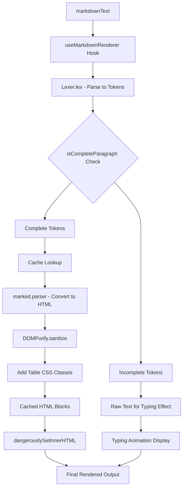
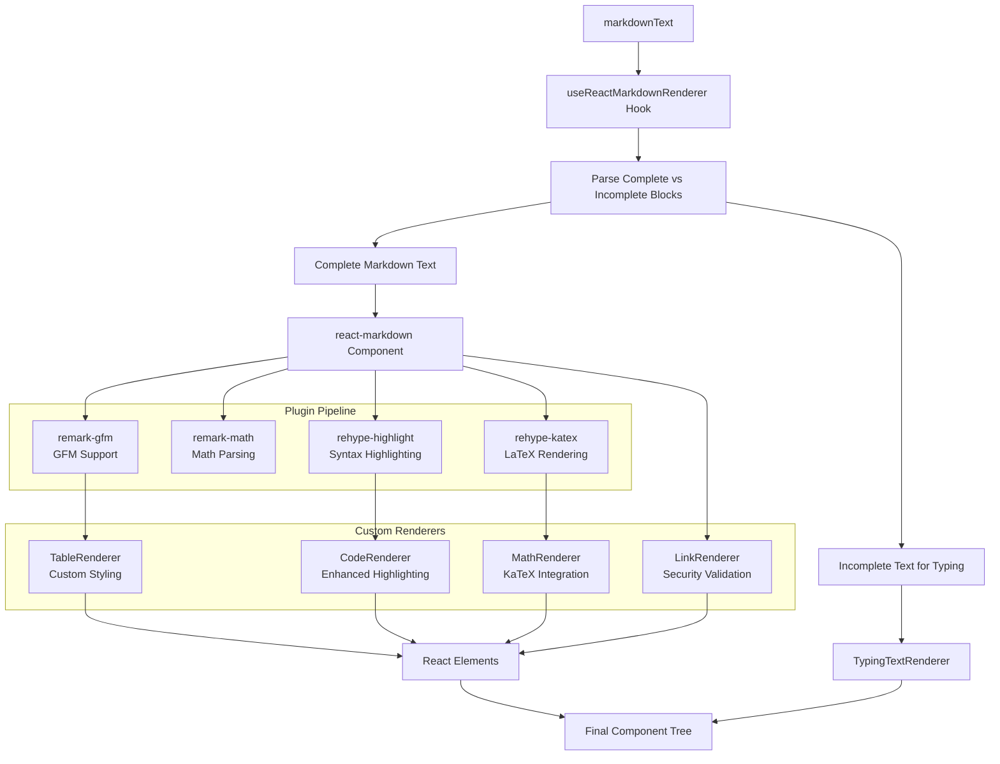
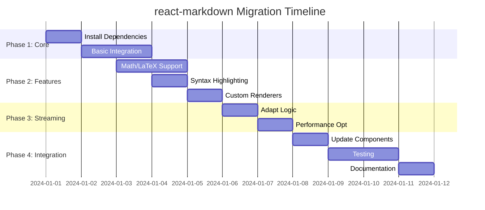

# react-markdown Migration Proposal

## Executive Summary

This document outlines the migration plan from the current `marked` + `marked-highlight` + `highlight.js` implementation to `react-markdown` with enhanced plugin support for GitHub Flavored Markdown (GFM), mathematics/LaTeX rendering, and improved syntax highlighting.

## Current Implementation Analysis

### Architecture Overview

The current markdown rendering system in `packages/react/src/components/templates/text-template/use-markdown-renderer.tsx` implements a sophisticated streaming markdown renderer with the following components:



### Current Dependencies

```json
{
  "marked": "^15.0.8",
  "marked-highlight": "^2.2.1", 
  "highlight.js": "^11.11.1",
  "dompurify": "^3.2.5"
}
```

### Key Features

1. **Streaming/Typing Effect**: 
   - Parses markdown into tokens using `Lexer.lex()`
   - Determines complete vs incomplete blocks based on paragraph endings (`.`, `。`, `！`, newlines)
   - Renders complete blocks immediately while showing incomplete text as "typing"

2. **Performance Optimization**:
   - Uses `Map` cache (`cacheRef`) to avoid re-parsing completed blocks
   - Debounced rendering with configurable delay (default 100ms)

3. **Security**: 
   - Uses `DOMPurify.sanitize()` to prevent XSS attacks
   - Sanitizes all HTML output before rendering

4. **Syntax Highlighting**:
   - Integrates `highlight.js` via `marked-highlight`
   - Automatic language detection with fallback to plaintext
   - CSS class prefixes: `hljs language-*`

5. **Custom Styling**:
   - Wraps tables with custom CSS container: `table_container`
   - Applies SCSS module classes for theming

### Interface Contract

```typescript
interface MarkdownRenderResult {
  htmlBlocks: ReactNode;
  lastTypingText: string;
}

function useMarkdownRenderer(
  markdownText: string,
  delay = 100
): MarkdownRenderResult
```

### Current Limitations

1. **No GFM Support**: Missing tables, strikethrough, task lists, autolinks
2. **No Math/LaTeX**: Cannot render mathematical expressions
3. **Security Concerns**: Relies on `dangerouslySetInnerHTML`
4. **Limited Extensibility**: Difficult to add new markdown features
5. **Bundle Size**: Multiple libraries for overlapping functionality

## Migration Proposal

### New Architecture with react-markdown



### Proposed Dependencies

```json
{
  "react-markdown": "^9.0.1",
  "remark-gfm": "^4.0.0",
  "remark-math": "^6.0.0", 
  "rehype-katex": "^7.0.1",
  "rehype-highlight": "^7.0.1",
  "katex": "^0.16.9"
}
```

**Dependencies to Remove:**
- `marked`: `^15.0.8`
- `marked-highlight`: `^2.2.1` 
- `highlight.js`: `^11.11.1`
- `dompurify`: `^3.2.5` (no longer needed)

### Enhanced Features

1. **GitHub Flavored Markdown (GFM)**:
   - Tables with alignment support
   - Strikethrough text (`~~text~~`)
   - Task lists (`- [x] completed`, `- [ ] todo`)
   - Autolinks for URLs and email addresses
   - Extended URL linking

2. **Mathematics & LaTeX**:
   - Inline math: `$E = mc^2$`
   - Block math: `$$\int_{-\infty}^{\infty} e^{-x^2} dx = \sqrt{\pi}$$`
   - Full KaTeX feature support
   - Automatic math expression detection

3. **Enhanced Security**:
   - Native React component rendering (no `dangerouslySetInnerHTML`)
   - Built-in XSS protection via react-markdown
   - Safe link handling with URI validation integration

4. **Improved Syntax Highlighting**:
   - Consistent with current `highlight.js` styling
   - Better language detection
   - Performance optimizations

### Implementation Strategy

#### Phase 1: Core Migration (1-2 days)

1. **Install Dependencies**
   ```bash
   yarn add react-markdown remark-gfm remark-math rehype-katex rehype-highlight katex
   ```

2. **Create New Hook Structure**
   ```typescript
   // New file: use-react-markdown-renderer.tsx
   function useReactMarkdownRenderer(
     markdownText: string,
     delay = 100
   ): MarkdownRenderResult {
     // Implementation preserving current interface
   }
   ```

3. **Basic react-markdown Integration**
   - Configure base plugins (remark-gfm)
   - Implement custom component renderers
   - Maintain streaming/typing functionality

#### Phase 2: Feature Enhancement (2-3 days)

1. **Math/LaTeX Support**
   - Configure `remark-math` + `rehype-katex`
   - Add KaTeX CSS imports
   - Create custom math component renderers

2. **Syntax Highlighting**
   - Configure `rehype-highlight`
   - Maintain `highlight.js` compatibility
   - Preserve existing CSS classes

3. **Custom Component Renderers**
   ```typescript
   const components = {
     table: CustomTableRenderer,
     code: CustomCodeRenderer,
     a: SafeLinkRenderer,
     // Add other custom renderers as needed
   };
   ```

#### Phase 3: Streaming Integration (1-2 days)

1. **Adapt Streaming Logic**
   ```typescript
   // Preserve current streaming approach
   const parseCompleteBlocks = (markdown: string) => {
     // Similar logic to current isCompleteParagraph
     // Return: { completeMarkdown, incompleteText }
   };
   ```

2. **Performance Optimization**
   - Implement caching for react-markdown output
   - Optimize re-rendering with React.memo
   - Maintain debounced updates

#### Phase 4: Integration & Testing (1-2 days)

1. **Update TextTemplate Component**
   ```typescript
   // In text-template.tsx
   const { reactElements, lastTypingText } = useReactMarkdownRenderer(
     (message as ConversationBotMessage)?.message?.text || '',
     20
   );
   ```

2. **Comprehensive Testing**
   - Unit tests for new hook
   - Integration tests with existing components
   - Visual regression tests for styling
   - Performance benchmarking

3. **CSS & Styling Updates**
   - Import KaTeX CSS: `import 'katex/dist/katex.min.css'`
   - Update table styling for new structure
   - Ensure theme compatibility

### Interface Compatibility

**Maintaining Current Interface:**
```typescript
// Current interface (preserved)
interface MarkdownRenderResult {
  htmlBlocks: ReactNode;      // Now returns React elements instead of HTML
  lastTypingText: string;     // Unchanged
}

// Usage remains identical
const { htmlBlocks, lastTypingText } = useMarkdownRenderer(text, delay);
```

**Breaking Changes:** None - complete backward compatibility maintained.

### Custom Component Renderers

#### Table Renderer
```typescript
const CustomTableRenderer = ({ children, ...props }) => (
  <div className={classes.table_container}>
    <table {...props}>{children}</table>
  </div>
);
```

#### Code Renderer
```typescript
const CustomCodeRenderer = ({ children, className, ...props }) => {
  const language = className?.replace('language-', '') || 'plaintext';
  return (
    <code className={`hljs language-${language}`} {...props}>
      {children}
    </code>
  );
};
```

#### Safe Link Renderer
```typescript
const SafeLinkRenderer = ({ href, children, ...props }) => {
  const handleClick = (e) => {
    e.preventDefault();
    safeWindowOpen(href, '_blank'); // Use existing URI validation
  };
  return <a href={href} onClick={handleClick} {...props}>{children}</a>;
};
```

### Performance Considerations

1. **Bundle Size Impact**:
   - `katex`: ~280KB (largest addition)
   - `react-markdown`: ~50KB
   - **Net change**: +200KB (math support trade-off)

2. **Runtime Performance**:
   - React component rendering vs HTML parsing
   - Caching strategy for processed markdown
   - Lazy loading for KaTeX when math detected

3. **Memory Usage**:
   - Component tree vs HTML strings
   - Cache management for long conversations

### Migration Timeline



### Risk Assessment & Mitigation

#### High Risk
1. **Streaming Performance**: React re-renders vs HTML updates
   - *Mitigation*: Implement React.memo, optimize component structure
   
2. **Bundle Size**: KaTeX significantly increases bundle
   - *Mitigation*: Code splitting, lazy loading math features

#### Medium Risk  
3. **Styling Consistency**: Component-based rendering changes CSS targeting
   - *Mitigation*: Thorough visual testing, CSS selector updates

4. **Breaking Changes**: Plugin API changes between versions
   - *Mitigation*: Pin dependency versions, comprehensive testing

#### Low Risk
5. **Feature Parity**: Missing current functionality
   - *Mitigation*: Maintain interface compatibility, feature mapping

### Testing Strategy

1. **Unit Tests**:
   - Hook functionality testing
   - Custom renderer testing
   - Plugin integration testing

2. **Integration Tests**:
   - TextTemplate component integration
   - Streaming behavior validation
   - Performance benchmarking

3. **Visual Tests**:
   - Style consistency verification
   - Math rendering accuracy
   - Syntax highlighting comparison

4. **Security Tests**:
   - XSS prevention validation
   - Link safety verification
   - HTML sanitization testing

### Success Criteria

1. **Functional**:
   - ✅ All existing markdown features work
   - ✅ Streaming/typing effect preserved
   - ✅ Performance within 10% of current implementation

2. **Enhanced**:
   - ✅ GFM features working (tables, task lists, etc.)
   - ✅ Math/LaTeX rendering functional
   - ✅ Improved syntax highlighting

3. **Technical**:
   - ✅ No breaking changes to public API
   - ✅ Bundle size increase < 300KB
   - ✅ All tests passing

### Rollback Plan

If migration encounters critical issues:

1. **Immediate**: Revert to current implementation
2. **Preserve**: Keep new dependencies for future attempts  
3. **Analysis**: Document specific blockers
4. **Timeline**: Plan resolution and retry timeline

---

## Conclusion

This migration to `react-markdown` provides significant enhancements while maintaining complete backward compatibility. The new architecture offers better security, enhanced features (GFM, math), and improved maintainability through React's component model.

The phased approach minimizes risk while ensuring thorough testing at each stage. The estimated timeline of 7-10 days allows for careful implementation and comprehensive validation.

**Recommendation**: Proceed with migration following the outlined phases, with careful monitoring of performance and bundle size impacts.